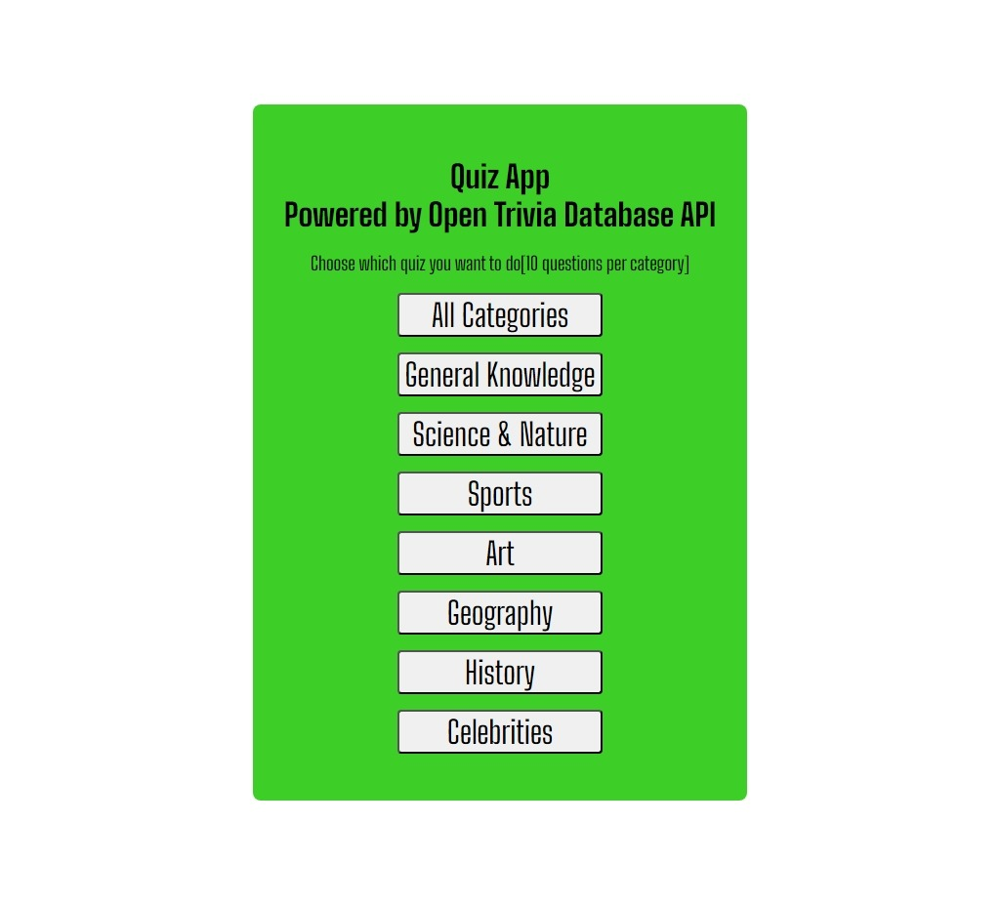
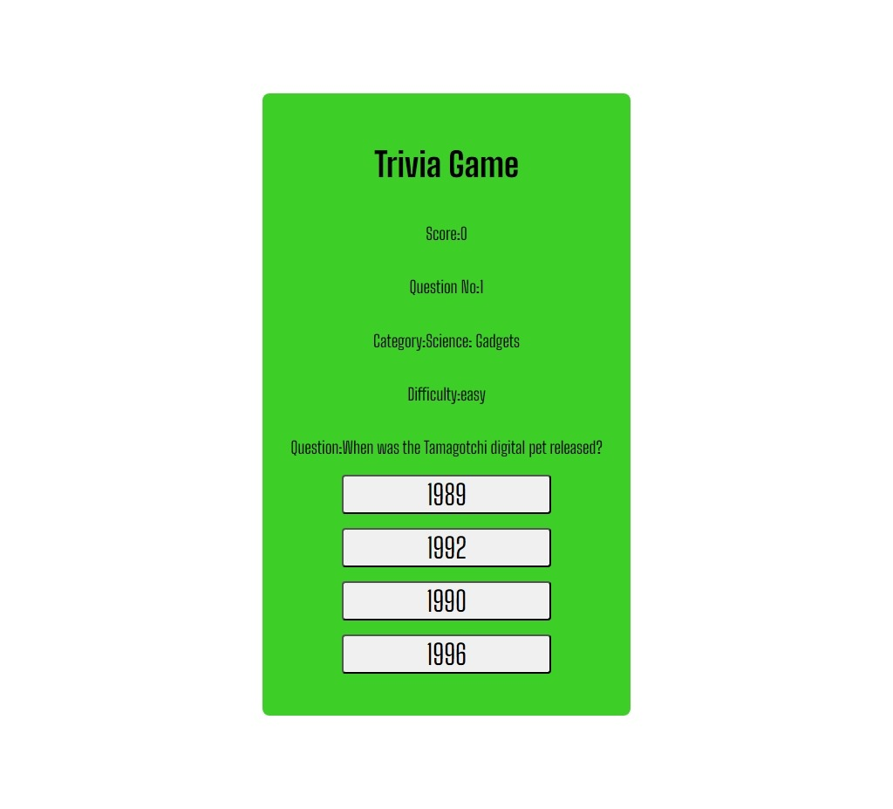

# Trivia App Using OpenTriviaDB

This is a web app using the OpenTriviaDB API on the internet to create trivia questions.

It can:

- generate random questions depending on the category you pick.
- has a score system to track how many questions you got right
- and the like.

## Built with

- HTML
- CSS
- JavaScript

# Screenshots

## Main Page

## Quiz Page

# Link

# Contacts

# Credits

